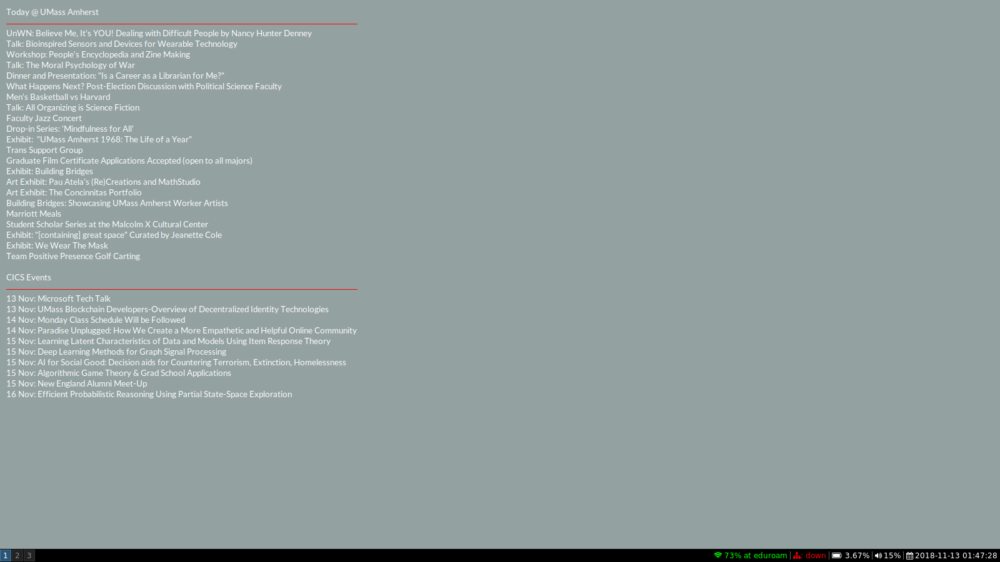

# conky-umass-events
It's a [Conky](https://github.com/brndnmtthws/conky) configuration I use. It shows [events happening today at UMass Amherst](https://www.umass.edu/events/) and [upcoming events for the CICS](https://www.cics.umass.edu/events).

# Using this configuration

Requirements:
 * Conky
 * Python 3
 * BeautifulSoup 4
 * requests

Installation:
 1. Put .conkyrc in your home folder
 2. Put the Python scripts in ~/.config/conky
